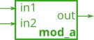
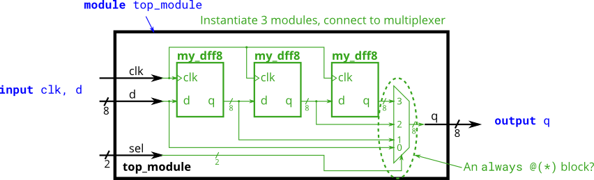

# Module

By now, you're familiar with a module, which is a circuit that interacts with its outside through input and output ports. Larger, more complex circuits are built by composing bigger modules out of smaller modules and other pieces (such as assign statements and always blocks) connected together. This forms a hierarchy, as modules can contain instances of other modules.

The figure below shows a very simple circuit with a sub-module. In this exercise, create one instance of module mod_a, then connect the module's three pins (in1, in2, and out) to your top-level module's three ports (wires a, b, and out). The module mod_a is provided for you — you must instantiate it.

When connecting modules, only the ports on the module are important. You do not need to know the code inside the module. The code for module mod_a looks like this:

```verilog
module mod_a ( input in1, input in2, output out );
    // Module body
endmodule
```


The hierarchy of modules is created by instantiating one module inside another, as long as all of the modules used belong to the same project (so the compiler knows where to find the module). The code for one module is not written inside another module's body (Code for different modules are not nested).

You may connect signals to the module by port name or port position. For extra practice, try both methods.


## Connecting Signals to Module Ports

There are two commonly-used methods to connect a wire to a port: by position or by name.

### By position

The syntax to connect wires to ports by position should be familiar, as it uses a C-like syntax. When instantiating a module, ports are connected left to right according to the module's declaration. For example:

mod_a instance1 ( wa, wb, wc );

This instantiates a module of type mod_a and gives it an instance name of "instance1", then connects signal wa (outside the new module) to the first port (in1) of the new module, wb to the second port (in2), and wc to the third port (out). One drawback of this syntax is that if the module's port list changes, all instantiations of the module will also need to be found and changed to match the new module.

### By name

Connecting signals to a module's ports by name allows wires to remain correctly connected even if the port list changes. This syntax is more verbose, however.

mod_a instance2 ( .out(wc), .in1(wa), .in2(wb) );

The above line instantiates a module of type mod_a named "instance2", then connects signal wa (outside the module) to the port named in1, wb to the port named in2, and wc to the port named out. Notice how the ordering of ports is irrelevant here because the connection will be made to the correct name, regardless of its position in the sub-module's port list. Also notice the period immediately preceding the port name in this syntax.

```verilog
module top_module (
	input a,
	input b,
	output out
);

	// Create an instance of "mod_a" named "inst1", and connect ports by name:
	mod_a inst1 (
		.in1(a), 	// Port"in1"connects to wire "a"
		.in2(b),	// Port "in2" connects to wire "b"
		.out(out)	// Port "out" connects to wire "out"
				// (Note: mod_a's port "out" is not related to top_module's wire "out".
				// It is simply coincidence that they have the same name)
	);

/*
	// Create an instance of "mod_a" named "inst2", and connect ports by position:
	mod_a inst2 ( a, b, out );	// The three wires are connected to ports in1, in2, and out, respectively.
*/

endmodule
```

# Connecting ports by position

This problem is similar to the previous one (module). You are given a module named mod_a that has 2 outputs and 4 inputs, in that order. You must connect the 6 ports by position to your top-level module's ports out1, out2, a, b, c, and d, in that order.

You are given the following module:

module mod_a ( output, output, input, input, input, input );


## Solutions:

```verilog
module top_module (
  input a,
  input b,
  input c,
  input d,
  output out1,
  output out2
);
  mod_a inst1 (out1,out2,a,b,c,d);
endmodule
```

# Connecting ports by name

This problem is similar to module. You are given a module named mod_a that has 2 outputs and 4 inputs, in some order. You must connect the 6 ports by name to your top-level module's ports:
You are given the following module:

module mod_a ( output out1, output out2, input in1, input in2, input in3, input in4);


```verilog
module top_module (
    input a,
    input b,
    input c,
    input d,
    output out1,
    output out2
);
    mod_a inst1 (
      	.in1(a),
      	.in2(b),
      	.in3(c),
      	.in4(d),
      	.out1(out1),
      	.out2(out2));

endmodule
```

# Three modules

You are given a module my_dff with two inputs and one output (that implements a D flip-flop). Instantiate three of them, then chain them together to make a shift register of length 3. The clk port needs to be connected to all instances.

The module provided to you is: module my_dff ( input clk, input d, output q );

Note that to **make the internal connections, you will need to declare some wires.** Be careful about naming your wires and module instances: the names must be unique.


## Solutions:

```verilog
module top_module ( input clk, input d, output q );

    wire a, b;

	my_dff dff1 ( .clk(clk), .d(d), .q(a));
	my_dff dff2 ( .clk(clk), .d(a), .q(b));
	my_dff dff3 ( .clk(clk), .d(b), .q(q));
endmodule

```

# Modules and vectors

This exercise is an extension of module_shift. Instead of module ports being only single pins, we now have modules with vectors as ports, to which you will attach wire vectors instead of plain wires. Like everywhere else in Verilog, the vector length of the port does not have to match the wire connecting to it, but this will cause zero-padding or trucation of the vector. This exercise does not use connections with mismatched vector lengths.

You are given a module my_dff8 with two inputs and one output (that implements a set of 8 D flip-flops). Instantiate three of them, then chain them together to make a 8-bit wide shift register of length 3. In addition, create a 4-to-1 multiplexer (not provided) that chooses what to output depending on sel[1:0]: The value at the input d, after the first, after the second, or after the third D flip-flop. (Essentially, sel selects how many cycles to delay the input, from zero to three clock cycles.)

The module provided to you is: module my_dff8 ( input clk, input [7:0] d, output [7:0] q );

The multiplexer is not provided. One possible way to write one is inside an always block with a case statement inside. (See also: mux9to1v)



## tips and tricks

truncation and zero padding all have to align to the right.
always block and sensitive list refresh:
https://www.javatpoint.com/verilog-always-block

## Solutions:

### initial wrong solution:

```verilog
module top_module (
    input clk,
    input [7:0] d,
    input [1:0] sel,
    output [7:0] q
);
    //instaniate
    wire a, b;  // WRONG becuz input is vector here,
                // wire should be the same size as req input
                // becuz q is not directly connect to the output
                // should add another wire to connect to mux
    my_dff8 my_dff1(.clk(clk), .d(d), .q(a));
    my_dff8 my_dff2(.clk(clk), .d(a), .q(b));
    my_dff8 my_dff3(.clk(clk), .d(b), .q(q));
    //4-to-1 multiplexer
     always@(*)
        case(sel)
            2'b00: q = d;
            2'b01: q = a;
            2'b10: q = b;
            2'b11: q = q;
        endcase

endmodule
```

### fixed solution

```verilog
module top_module (
	input clk,
	input [7:0] d,
	input [1:0] sel,
	output reg [7:0] q
);

	wire [7:0] o1, o2, o3;		// output of each my_dff8

	// Instantiate three my_dff8s
	my_dff8 d1 ( clk, d, o1 );
	my_dff8 d2 ( clk, o1, o2 );
	my_dff8 d3 ( clk, o2, o3 );

	// This is one way to make a 4-to-1 multiplexer
	always @(*)		// Combinational always block
		case(sel)
			2'h0: q = d;
			2'h1: q = o1;
			2'h2: q = o2;
			2'h3: q = o3;
		endcase

endmodule

```

# Module add

You are given a module add16 that performs a 16-bit addition. Instantiate two of them to create a 32-bit adder. One add16 module computes the lower 16 bits of the addition result, while the second add16 module computes the upper 16 bits of the result, after receiving the carry-out from the first adder. Your 32-bit adder does not need to handle carry-in (assume 0) or carry-out (ignored), but the internal modules need to in order to function correctly. (In other words, the add16 module performs 16-bit a + b + cin, while your module performs 32-bit a + b).

Connect the modules together as shown in the diagram below. The provided module add16 has the following declaration:

module add16 ( input[15:0] a, input[15:0] b, input cin, output[15:0] sum, output cout );


## Module Declaration

```verilog
module top_module(
    input [31:0] a,
    input [31:0] b,
    output [31:0] sum
);

```

## Solution

```verilog
module top_module(
    input [31:0] a,
    input [31:0] b,
    output [31:0] sum
);
    wire c_oi;
    add16 a1(.a(a[15:0]), .b(b[15:0]), .cin(1'b0),.sum(sum[15:0]), .cout(c_oi));
    add16 a2(.a(a[31:16]), .b(b[31:16]),.cin(c_oi), .sum(sum[31:16]), .cout());


endmodule

```

# Module fadd

In this exercise, you will create a circuit with two levels of hierarchy. Your top_module will instantiate two copies of add16 (provided), each of which will instantiate 16 copies of add1 (which you must write). Thus, you must write two modules: top_module and add1.

Like module_add, you are given a module add16 that performs a 16-bit addition. You must instantiate two of them to create a 32-bit adder. One add16 module computes the lower 16 bits of the addition result, while the second add16 module computes the upper 16 bits of the result. Your 32-bit adder does not need to handle carry-in (assume 0) or carry-out (ignored).

Connect the add16 modules together as shown in the diagram below. The provided module add16 has the following declaration:

module add16 ( input[15:0] a, input[15:0] b, input cin, output[15:0] sum, output cout );

Within each add16, 16 full adders (module add1, not provided) are instantiated to actually perform the addition. You must write the full adder module that has the following declaration:

module add1 ( input a, input b, input cin, output sum, output cout );

Recall that a full adder computes the sum and carry-out of a+b+cin.

In summary, there are three modules in this design:

top_module — Your top-level module that contains two of...
add16, provided — A 16-bit adder module that is composed of 16 of...
add1 — A 1-bit full adder module.

If your submission is missing a module add1, you will get an error message that says Error (12006): Node instance "user_fadd[0].a1" instantiates undefined entity "add1".


## Tips and Tricks

The expression for a full adder is

```verilog
sum = a^b^cin;
cout = a&b | a&cin | b&cin
```

## Solutions

```verilog
// top module with 2 16bits adder
module top_module (
    input [31:0] a,
    input [31:0] b,
    output [31:0] sum
);
	wire c_oi;
    add16 a1(.a(a[15:0]), .b(b[15:0]), .cin(1'b0),.sum(sum[15:0]), .cout(c_oi));
    add16 a2(.a(a[31:16]), .b(b[31:16]),.cin(c_oi), .sum(sum[31:16]), .cout());

endmodule
// Full adder module here
module add1 ( input a, input b, input cin,   output sum, output cout );
    assign sum = a^b^cin;
    assign cout = a&b | a&cin | b&cin;


endmodule
```

# Module cseladd

One drawback of the ripple carry adder (See previous exercise) is that the delay for an adder to compute the carry out (from the carry-in, in the worst case) is fairly slow, and the second-stage adder cannot begin computing its carry-out until the first-stage adder has finished. This makes the adder slow. One improvement is a **carry-select adder**, shown below. The first-stage adder is the same as before, but we **duplicate the second-stage adder, one assuming carry-in=0 and one assuming carry-in=1, then using a fast 2-to-1 multiplexer to select which result happened to be correct.**

In this exercise, you are provided with the same module add16 as the previous exercise, which adds two 16-bit numbers with carry-in and produces a carry-out and 16-bit sum. You must instantiate three of these to build the carry-select adder, using your own 16-bit 2-to-1 multiplexer.

Connect the modules together as shown in the diagram below. The provided module add16 has the following declaration:

module add16 ( input[15:0] a, input[15:0] b, input cin, output[15:0] sum, output cout );


## Solutions

```verilog
module top_module(
    input [31:0] a,
    input [31:0] b,
    output [31:0] sum
);
    wire cout1;
    wire [15:0] sum2, sum3;
    add16 a1(.a(a[15:0]), .b(b[15:0]), .cin(1'b0), .sum(sum[15:0]), .cout(cout1));
    add16 a2(.a(a[31:16]), .b(b[31:16]), .cin(1'b0), .sum(sum2), .cout());
    add16 a3(.a(a[31:16]), .b(b[31:16]), .cin(1'b1), .sum(sum3), .cout());

    always@(*)  // don't forget to add always for mux!
        case(cout1)
            1'b0: sum[31:16] = sum2;
            1'b1: sum[31:16] = sum3;
        endcase

endmodule
```

# Module addsub

An adder-subtractor can be built from an adder by optionally negating one of the inputs, which is equivalent to inverting the input then adding 1. The net result is a circuit that can do two operations: (a + b + 0) and (a + ~b + 1). See Wikipedia if you want a more detailed explanation of how this circuit works.

Build the adder-subtractor below.

You are provided with a 16-bit adder module, which you need to instantiate twice:

module add16 ( input[15:0] a, input[15:0] b, input cin, output[15:0] sum, output cout );

Use a 32-bit wide XOR gate to invert the b input whenever sub is 1. (This can also be viewed as b[31:0] XORed with sub replicated 32 times. See replication operator.). Also connect the sub input to the carry-in of the adder.


## Tips and tricks

ternary opertor

```verilog
condition ? if true : if false
// example
tone[23] ? clkdivider-1 : clkdivider/2-1
// eqv
if tone[23] is 1, counter = clkdivider-1
else counter = clkdivider/2-1
```

## Solution:

```verilog
module top_module(
    input [31:0] a,
    input [31:0] b,
    input sub,
    output [31:0] sum
);
    wire cout;
    add16 a1(.a(a[15:0]), .b(sub ? ~(b[15:0]) : b[15:0]), .cin(sub), . cout(cout), .sum(sum[15:0]) );
    add16 a2(.a(a[31:16]), .b(sub ? ~(b[31:16]) : b[31:16]), .cin(cout), . cout(), .sum(sum[31:16]) );
endmodule

```
