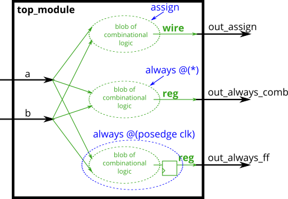
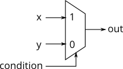

# Always blocks (combinational)

Since digital circuits are composed of logic gates connected with wires, any circuit can be expressed as some combination of modules and assign statements. However, sometimes this is not the most convenient way to describe the circuit. Procedures (of which always blocks are one example) provide an alternative syntax for describing circuits.

For **synthesizing hardware**, two types of always blocks are relevant:

- Combinational: always @(\*)
- Clocked: always @(posedge clk)

Combinational always blocks are equivalent to assign statements, thus there is always a way to express a combinational circuit both ways. The choice between which to use is mainly an issue of which syntax is more convenient. **The syntax for code inside a procedural block is different from code that is outside**. Procedural blocks have a richer set of statements (e.g., if-then, case), cannot contain continuous assignments*, but also introduces many new non-intuitive ways of making errors. (*Procedural continuous assignments do exist, but are somewhat different from continuous assignments, and are not synthesizable.)

For example, the assign and combinational always block describe the same circuit. Both create the same blob of combinational logic. Both will recompute the output whenever any of the inputs (right side) changes value.

```verilog
assign out1 = a & b | c ^ d;
always @(*) out2 = a & b | c ^ d;
```


For combinational always blocks, always use a sensitivity list of (\_). Explicitly listing out the signals is error-prone (if you miss one), and is ignored for hardware synthesis. If you explicitly specify the sensitivity list and miss a signal, the synthesized hardware will still behave as though (\*） was specified, but the simulation will not and not match the hardware's behaviour. (In SystemVerilog, use always_comb.)

## Note

A note on wire vs. reg: The left-hand-side of an assign statement must be a net type (e.g., wire), while the left-hand-side of a procedural assignment (in an always block) must be a variable type (e.g., reg). These types (wire vs. reg) have nothing to do with what hardware is synthesized, and is just syntax left over from Verilog's use as a hardware simulation language.

## Practice

Build an AND gate using both an assign statement and a combinational always block. (Since assign statements and combinational always blocks function identically, there is no way to enforce that you're using both methods. But you're here for practice, right?...)

### Module Declaration

```verilog
// synthesis verilog_input_version verilog_2001
module top_module(
    input a,
    input b,
    output wire out_assign,
    output reg out_alwaysblock
);
```

### Solutions

```verilog
module top_module(
    input a,
    input b,
    output wire out_assign,
    output reg out_alwaysblock
);
   	assign out_assign = a & b;
    always @(*) out_alwaysblock = a & b;
endmodule
```

### Other things that worth mentioning

Although 'always' block provides an efficient way of describing the circuit. When using if/else/for to create a complicated circuit, the result might be a mess as it is difficult to describe the details on the circuit structure. That's why using assigns and logic gate may be seen as a dumb way, it can mitigate the flaws.

# Always blocks (clocked)

For hardware synthesis, there are two types of always blocks that are relevant:

- Combinational: always @(\*)
- Clocked: always @(posedge clk)

Clocked always blocks create a blob of combinational logic just like combinational always blocks, but also creates a set of flip-flops (or "registers") at the output of the blob of combinational logic. Instead of the outputs of the blob of logic being visible immediately, the outputs are visible only immediately after the next (posedge clk).

## Blocking vs. Non-Blocking Assignment

There are three types of assignments in Verilog:

- Continuous assignments (assign x = y;). Can only be used when not inside a procedure ("always block").
- Procedural blocking assignment: (x = y;). Can only be used inside a procedure.
- Procedural non-blocking assignment: (x <= y;). Can only be used inside a procedure.

In a **combinational** always block, use **blocking** assignments. In a **clocked** always block, use **non-blocking** assignments. A full understanding of why is not particularly useful for hardware design and requires a good understanding of how Verilog simulators keep track of events. Not following this rule results in extremely hard to find errors that are both non-deterministic and differ between simulation and synthesized hardware.

### Take aways

```verilog
// cominational always block:
always @(*)
// use blocking assignments:
  x = y

// clocked always block:
always @(posedge clk)
// use non-blocking:
  x <= y
// tips: becuz the diff between clocked and comb block is that
// comb block will have a set of flip flops, can picture the '<' symbol
// as flip flops to memorize
```

## Practice

Build an XOR gate three ways, using an assign statement, a combinational always block, and a clocked always block. Note that the clocked always block produces a different circuit from the other two: There is a flip-flop so the output is delayed.


### Solutions

```verilog
module top_module(
    input clk,
    input a,
    input b,
    output wire out_assign,
    output reg out_always_comb,
    output reg out_always_ff   );

    assign out_assign = a ^ b;
    always@(*)
        out_always_comb = a ^ b;
    always@(posedge clk)
        out_always_ff <= a ^ b;


endmodule
```

# If statement

An if statement usually creates a 2-to-1 multiplexer, selecting one input if the condition is true, and the other input if the condition is false.


```verilog
always @(*) begin
    if (condition) begin
        out = x;
    end
    else begin
        out = y;
    end
end
```

This is equivalent to using a continuous assignment with a conditional operator:

```verilog
assign out = (condition) ? x : y;
```

However, the procedural if statement provides a new way to make mistakes. The circuit is combinational only if out is always assigned a value.

## Practice

Build a 2-to-1 mux that chooses between a and b. Choose b if both sel_b1 and sel_b2 are true. Otherwise, choose a. Do the same twice, once using assign statements and once using a procedural if statement.

| sel_b1 | sel_b2 | out_assign |
| ------ | ------ | ---------- |
| 0      | 0      | 0          |
| 0      | 1      | a          |
| 1      | 0      | a          |
| 1      | 1      | b          |

### Solutions:

```verilog
module top_module(
    input a,
    input b,
    input sel_b1,
    input sel_b2,
    output wire out_assign,
    output reg out_always
);

    assign out_assign = (sel_b1&sel_b2)? b : a;
    always @(*) begin
        if(sel_b1&sel_b2)
            out_always = b;
        else
            out_always = a;
    end

endmodule
```

# If statement latches

## A common source of errors: How to avoid making latches

When designing circuits, you must think first in terms of circuits:

- I want this logic gate
- I want a combinational blob of logic that has these inputs and produces these outputs
- I want a combinational blob of logic followed by a set of flip-flops

What you must not do is write the code first, then hope it generates a proper circuit.

- If (cpu_overheated) then shut_off_computer = 1;
- If (~arrived) then keep_driving = ~gas_tank_empty;

Syntactically-correct code does not necessarily result in a reasonable circuit (combinational logic + flip-flops). The usual reason is: "**What happens in the cases other than those you specified?**". Verilog's answer is: **Keep the outputs unchanged**.
This behaviour of "keep outputs unchanged" means the **current state needs to be remembered**, and thus produces a latch. Combinational logic (e.g., logic gates) cannot remember any state. Watch out for **Warning (10240): ... inferring latch(es)"** messages. Unless the latch was intentional, it almost always indicates a bug. Combinational circuits must have a value assigned to all outputs under all conditions. This usually means you always need else clauses or a default value assigned to the outputs.

## Demonstration

The following code contains incorrect behaviour that creates a latch. Fix the bugs so that you will shut off the computer only if it's really overheated, and stop driving if you've arrived at your destination or you need to refuel.


```verilog
always @(*) begin
    if (cpu_overheated)
       shut_off_computer = 1;
end

always @(*) begin
    if (~arrived)
       keep_driving = ~gas_tank_empty;
end
```

### Solutions (Fixes)

```verilog
module top_module (
    input      cpu_overheated,
    output reg shut_off_computer,
    input      arrived,
    input      gas_tank_empty,
    output reg keep_driving  ); //

    always @(*) begin
        if (cpu_overheated)
           shut_off_computer = 1;
        // if not specify else statement
        // verilog will keep the org value
        // eg: shut_off_computer = shut_off_compute
        // so that it either is 1 or x
        // onve the shut off is 1, it will always be 1
        // no matter how the cpu overheat is changed
        // which means it became a latch
        else
           shut_off_computer = 0;
    end

    always @(*) begin
        if (~arrived)
           keep_driving = ~gas_tank_empty;
        else
           keep_driving = 0;
    end

endmodule
```

# Always case

Case statements in Verilog are nearly equivalent to a sequence of if-elseif-else that compares one expression to a list of others. Its syntax and functionality differs from the switch statement in C.

```verilog
always @(*) begin     // This is a combinational circuit
    case (in)
      1'b1: begin
               out = 1'b1;  // begin-end if >1 statement
            end
      1'b0: out = 1'b0;
      default: out = 1'bx;
    endcase
end
```

- The case statement begins with case and each "case item" ends with a colon. There is no "switch".
- Each case item can execute exactly one statement. This makes the "break" used in C unnecessary. But this means that if you need more than one statement, you must use begin ... end.
- Duplicate (and partially overlapping) case items are permitted. The first one that matches is used. C does not allow duplicate case items.

## practice

Case statements are more convenient than if statements if there are a large number of cases. So, in this exercise, create a 6-to-1 multiplexer. When sel is between 0 and 5, choose the corresponding data input. Otherwise, output 0. The data inputs and outputs are all 4 bits wide.

Be careful of inferring latches (See.always_if2)

### solutions

```verilog
module top_module (
    input [2:0] sel,
    input [3:0] data0,
    input [3:0] data1,
    input [3:0] data2,
    input [3:0] data3,
    input [3:0] data4,
    input [3:0] data5,
    output reg [3:0] out   );//

    always@(*) begin  // This is a combinational circuit
        case(sel)
            3'b000: out = data0;
            3'b001: out = data1;
            3'b010: out = data2;
            3'b011: out = data3;
            3'b100: out = data4;
            3'b101: out = data5;
            default: out = 4'b0;
            // can use 3'd1, 3'd2 as well
        endcase
    end

endmodule

```

# Priority encoder

A priority encoder is a combinational circuit that, when given an input bit vector, outputs the position of the first 1 bit in the vector. For example, a 8-bit priority encoder given the input 8'b10010000 would output 3'd4, because bit[4] is first bit that is high.

Build a 4-bit priority encoder. For this problem, if none of the input bits are high (i.e., input is zero), output zero. Note that a 4-bit number has 16 possible combinations.

## Solutions

```verilog
// synthesis verilog_input_version verilog_2001
module top_module (
    input [3:0] in,
    output reg [1:0] pos  );
    always @(*) begin
      case(in)
        4'b0000: pos = 2'b00;
        4'b0001: pos = 2'b00;
        4'b0010: pos = 2'b01;
        4'b0011: pos = 2'b00;
        4'b0100: pos = 2'b10;
        4'b0101: pos = 2'b00;
        4'b0110: pos = 2'b01;
        4'b0111: pos = 2'b00;
        4'b1000: pos = 2'b11;
        4'b1001: pos = 2'b00;
        4'b1010: pos = 2'b01;
        4'b1011: pos = 2'b00;
        4'b1100: pos = 2'b10;
        4'b1101: pos = 2'b00;
        4'b1110: pos = 2'b01;
        4'b1111: pos = 2'b00;
        default: pos = 2'b00; //can omit this since all cases included
      endcase
    end

endmodule

```

# Priority encoder with casez

Build a priority encoder for 8-bit inputs. Given an 8-bit vector, the output should report the first (least significant) bit in the vector that is 1. Report zero if the input vector has no bits that are high. For example, the input 8'b10010000 should output 3'd4, because bit[4] is first bit that is high.

From the previous exercise (always_case2), there would be 256 cases in the case statement. We can reduce this (down to 9 cases) if the case items in the case statement supported don't-care bits. This is what casez is for: **It treats bits that have the value z as don't-care in the comparison**.

For example, this would implement the 4-input priority encoder from the previous exercise:

```verilog
always @(*) begin
    casez (in[3:0])
        4'bzzz1: out = 0;   // in[3:1] can be anything
        4'bzz1z: out = 1;
        4'bz1zz: out = 2;
        4'b1zzz: out = 3;
        default: out = 0;
    endcase
end
```

A case statement behaves as though each item is checked sequentially (in reality, a big combinational logic function). Notice how there are certain inputs (e.g., 4'b1111) that will match more than one case item. The first match is chosen (so 4'b1111 matches the first item, out = 0, but not any of the later ones).

There is also a similar casex that treats both x and z as don't-care. I don't see much purpose to using it over casez.
The digit ? is a synonym for z. so 2'bz0 is the same as 2'b?0
It may be less error-prone to explicitly specify the priority behaviour rather than rely on the ordering of the case items. For example, the following will still behave the same way if some of the case items were reordered, because any bit pattern can only match at most one case item:

```verilog
casez (in[3:0])
        4'bzzz1: ...
        4'bzz10: ...
        4'bz100: ...
        4'b1000: ...
        default: ...
    endcase

```

## Solutions

```verilog
module top_module (
    input [7:0] in,
    output reg [2:0] pos );
    always @(*) begin
      casez(in)
          8'bzzzzzzz1: pos = 3'd0;
          8'bzzzzzz1z: pos = 3'd1;
          8'bzzzzz1zz: pos = 3'd2;
          8'bzzzz1zzz: pos = 3'd3;
          8'bzzz1zzzz: pos = 3'd4;
          8'bzz1zzzzz: pos = 3'd5;
          8'bz1zzzzzz: pos = 3'd6;
          8'b1zzzzzzz: pos = 3'd7;

      endcase
    end

endmodule
```

# Avoiding latches

Suppose you're building a circuit to process scancodes from a PS/2 keyboard for a game. Given the last two bytes of scancodes received, you need to indicate whether one of the arrow keys on the keyboard have been pressed. This involves a fairly simple mapping, which can be implemented as a case statement (or if-elseif) with four cases.

| scancode[15:0] | Arrow key   |
| -------------- | ----------- |
| 16'he06b       | left arrow  |
| 16'he072       | down arrow  |
| 16'he074       | righr arrow |
| 16'he075       | up arrow    |
| Anything else  | none        |

Your circuit has one 16-bit input, and four outputs. Build this circuit that recognizes these four scancodes and asserts the correct output.

To avoid creating latches, all outputs must be assigned a value in all possible conditions (See also always_if2). Simply having a default case is not enough. You must** assign a value to all four outputs** in all four cases and the default case. This can involve a lot of unnecessary typing. One easy way around this is to **assign a "default value" to the outputs before the case statement**:

```verilog
always @(*) begin
    up = 1'b0; down = 1'b0; left = 1'b0; right = 1'b0;
    case (scancode)
        ... // Set to 1 as necessary.
    endcase
end
```

This style of code ensures the outputs are assigned a value (of 0) in all possible cases unless the case statement overrides the assignment. This also means that a default: case item becomes unnecessary.

Reminder: The logic synthesizer generates a combinational circuit that behaves equivalently to what the code describes. Hardware does not "execute" the lines of code in sequence.

## Solutions:

```verilog
module top_module (
    input [15:0] scancode,
    output reg left,
    output reg down,
    output reg right,
    output reg up  );

    always @(*) begin
        // initialization to avoid latches
		left = 1'b0;
        down = 1'b0;
        right = 1'b0;
        up = 1'b0;
        case(scancode)
            16'he06b: left = 1;
			16'he072: down = 1;
			16'he074: right = 1;
			16'he075: up = 1;
            default: begin
                left = 0;
                down = 0;
                right = 0;
                up = 0;
            end

        endcase
    end

endmodule

```
