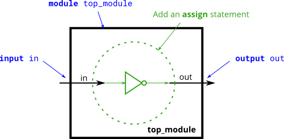

# Simple wire

Create a module with one input and one output that behaves like a wire.

Unlike physical wires, wires (and other signals) in Verilog are directional. This means information flows in only one direction, from (usually one) source to the sinks (The source is also often called a driver that drives a value onto a wire). In a Verilog "continuous assignment" (assign left_side = right_side;), **the value of the signal on the right side is driven onto the wire on the left side**. The assignment is "continuous" because the assignment continues all the time even if the right side's value changes. A continuous assignment is not a one-time event.

The ports on a module also have a direction (usually input or output). An input port is driven by something from outside the module, while an output port drives something outside. When viewed from inside the module, an input port is a driver or source, while an output port is a sink.

The diagram below illustrates how each part of the circuit corresponds to each bit of Verilog code. The module and port declarations create the black portions of the circuit. Your task is to create a wire (in green) by adding an assign statement to connect in to out. The parts outside the box are not your concern, but you should know that your circuit is tested by connecting signals from our test harness to the ports on your top_module.


## Take aways:

Assign left = right; is eqvilent to use a wire to connect 2 pin in thereal-world, signals flows from right to left. Left is sink and right is source.

## Solutions:

```verilog

module top_module( input in, output out );
    assign out = in
    // Note that wires are directional, so "assign in = out" is not equivalent.
endmodule

```

# Wire4

Create a module with 3 inputs and 4 outputs that behaves like wires that makes these connections:

a -> w
b -> x
b -> y
c -> z
The diagram below illustrates how each part of the circuit corresponds to each bit of Verilog code. From outside the module, there are three input ports and four output ports.

When you have multiple assign statements, **the order in which they appear in the code does not matter**. Unlike a programming language, assign statements ("continuous assignments") describe connections between things, not the action of copying a value from one thing to another.

One potential source of confusion that should perhaps be clarified now: The **green arrows here represent connections between wires**, but are **not wires in themselves**. The module itself already has 7 wires declared (named a, b, c, w, x, y, and z). This is because **input and output declarations actually declare a wire** unless otherwise specified. Writing input wire a is the same as input a. **Thus, the assign statements are not creating wires, they are creating the connections between the 7 wires that already exist.**


## Take aways:

Order of the components/wire in the circuit does not matter, the assignments are not creating wires, they are connecting them.

## Solutions:

```verilog

module top_module (
	input a,
	input b,
	input c,
	output w,
	output x,
	output y,
	output z  );

	assign w = a;
	assign x = b;
	assign y = b;
	assign z = c;

	// If we're certain about the width of each signal, using
	// the concatenation operator is equivalent and shorter:
	// assign {w,x,y,z} = {a,b,b,c};

endmodule

```

## Note:

Circuit can only have one source, but can have multiple sinks. It is due to if 2 source are different (1 and 0) then sink value is unkown.

# Notgate

Create a module that implements a NOT gate.

This circuit is similar to wire, but with a slight difference. When making the connection from the wire in to the wire out we're going to implement an inverter (or "NOT-gate") instead of a plain wire.

Use an assign statement. The assign statement will continuously drive the inverse of in onto wire out.


## Solutions:

```verilog

module top_module(
	input in,
	output out
);

	assign out = ~in;
  //assign out = !in; works as well
endmodule


```

## Note:

Verilog has separate bitwise-NOT (~) and logical-NOT (!) operators, like C. Since we're working with a one-bit here, it doesn't matter which we choose.

### ~ vs !

**(!) can only apply to one bit signal** eg: !1 = 0, it is an invertor in the circuit while (~) can apply to multiple bits signal eg: ~101 = 010

# Andgate

Create a module that implements an AND gate.

This circuit now has three wires (a, b, and out). Wires a and b already have values driven onto them by the input ports. But wire out currently is not driven by anything. Write an assign statement that drives out with the AND of signals a and b.

Note that this circuit is very similar to the NOT gate, just with one more input. If it sounds different, it's because I've started describing signals as being driven (has a known value determined by something attached to it) or not driven by something. Input wires are driven by something outside the module. assign statements will drive a logic level onto a wire. As you might expect, a wire cannot have more than one driver (what is its logic level if there is?), and a wire that has no drivers will have an undefined value (often treated as 0 when synthesizing hardware).


## Solutions:

```verilog

module top_module(
    input a,
    input b,
    output out );
    assign out = (a & b);

endmodule
```

## Note

Verilog has separate bitwise-AND (&) and logical-AND (&&) operators, like C. Since we're working with a one-bit here, it doesn't matter which we choose.

### & vs &&

& is bitwise operator it is calculated bit by bit. eg: 1011 & 0110 = 0010. While && see every bits as a whole, only when every bit is 0 it count as a 0 or it will count as 1. eg: 10 && 11 = 1, 10 && 00 = 0.

# Norgate

Create a module that implements a NOR gate. A NOR gate is an OR gate with its output inverted. A NOR function needs two operators when written in Verilog.

An assign statement drives a wire (or "net", as it's more formally called) with a value. This value can be as complex a function as you want, as long as it's a combinational (i.e., memory-less, with no hidden state) function. An assign statement is a continuous assignment because the output is "recomputed" whenever any of its inputs change, forever, much like a simple logic gate.


## Solutions:

```verilog

module top_module(
    input a,
    input b,
    output out );
    assign out = (a & b);

endmodule
```
