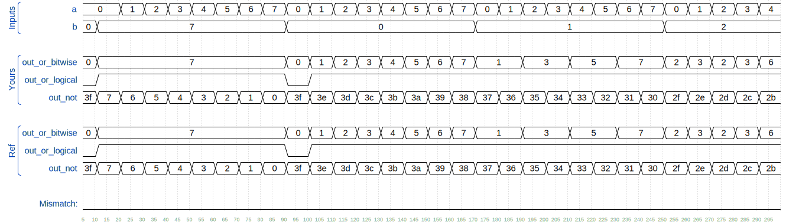

# Vector 0

Vectors are used to group related signals using one name to make it more convenient to manipulate. For example, wire [7:0] w; declares an 8-bit vector named w that is functionally equivalent to having 8 separate wires.

Notice that the declaration of a vector places the dimensions before the name of the vector, which is unusual compared to C syntax. However, the part select has the dimensions after the vector name as you would expect.

```verilog

wire [99:0] my_vector;      // Declare a 100-element vector
assign out = my_vector[10]; // Part-select one bit out of the vector

```

Build a circuit that has one 3-bit input, then outputs the same vector, and also splits it into three separate 1-bit outputs. Connect output o0 to the input vector's position 0, o1 to position 1, etc.

In a diagram, a tick mark with a number next to it indicates the width of the vector (or "bus"), rather than drawing a separate line for each bit in the vector.


## Take aways:

Assign left = right; is eqvilent to use a wire to connect 2 pin in thereal-world, signals flows from right to left. Left is sink and right is source.

## Solutions:

```verilog

module top_module(
	input [2:0] vec,
	output [2:0] outv,
	output o2,
	output o1,
	output o0
);

	assign outv = vec;

	// This is ok too: assign {o2, o1, o0} = vec;
	assign o0 = vec[0];
	assign o1 = vec[1];
	assign o2 = vec[2];

endmodule

```

# Vector in more detail

## Declaring Vectors

Vectors must be declared:

```verilog
type [upper:lower] vector_name;
```

type specifies the datatype of the vector. This is usually wire or reg. If you are declaring a input or output port, the type can additionally include the port type (e.g., input or output) as well. Some examples:

```verilog
wire [7:0] w;         // 8-bit wire
reg  [4:1] x;         // 4-bit reg
output reg [0:0] y;   // 1-bit reg that is also an output port (this is still a vector)
input wire [3:-2] z;  // 6-bit wire input (negative ranges are allowed)
output [3:0] a;       // 4-bit output wire. Type is 'wire' unless specified otherwise.
wire [0:7] b;         // 8-bit wire where b[0] is the most-significant bit.
```

The endianness (or, informally, "direction") of a vector is whether the the least significant bit has a lower index (little-endian, e.g., [3:0]) or a higher index (big-endian, e.g., [0:3]). In Verilog, once a vector is declared with a particular endianness, it must always be used the same way. e.g., writing vec[0:3] when vec is declared wire [3:0] vec; is illegal. Being consistent with endianness is good practice, as weird bugs occur if vectors of different endianness are assigned or used together.

### Implicit nets

Implicit nets are often a source of hard-to-detect bugs. In Verilog, net-type signals can be implicitly created by an assign statement or by attaching something undeclared to a module port. Implicit nets are always one-bit wires and causes bugs if you had intended to use a vector. Disabling creation of implicit nets can be done using the `default_nettype none directive.

```verilog
wire [2:0] a, c;   // Two vectors
assign a = 3'b101;  // a = 101
assign b = a;       // b =   1  implicitly-created wire
assign c = b;       // c = 001  <-- bug
my_module i1 (d,e); // d and e are implicitly one-bit wide if not declared.
                    // This could be a bug if the port was intended to be a vector.
```

Adding **`default_nettype none would make the second line of code an error**, which makes the bug more visible.

#### Take aways:

Always use the declared variables and pay attention to endianness.

### Unpacked vs. Packed Arrays

**You may have noticed that in declarations, the vector indices are written before the vector name. This declares the "packed" dimensions of the array**, where the bits are "packed" together into a blob (this is relevant in a simulator, but not in hardware). The unpacked dimensions are declared after the name. They are generally used to declare memory arrays. Since ECE253 didn't cover memory arrays, we have not used packed arrays in this course. See http://www.asic-world.com/systemverilog/data_types10.html for more details.

```verilog
reg [7:0] mem [255:0];   // 256 unpacked elements, each of which is a 8-bit packed vector of reg.
reg mem2 [28:0];         // 29 unpacked elements, each of which is a 1-bit reg.
```

### Take aways:

Vector set is a register, the vector indicies before the vector name is the size of every store unit.

## Accessing Vector Elements: Part-Select

Accessing an entire vector is done using the vector name. For example:

assign w = a;
takes the entire 4-bit vector a and assigns it to the entire 8-bit vector w (declarations are taken from above). If the lengths of the right and left sides don't match, it is zero-extended or truncated as appropriate.
The part-select operator can be used to access a portion of a vector:

```verilog
w[3:0]      // Only the lower 4 bits of w
x[1]        // The lowest bit of x
x[1:1]      // ...also the lowest bit of x
z[-1:-2]    // Two lowest bits of z
b[3:0]      // Illegal. Vector part-select must match the direction of the declaration.
b[0:3]      // The *upper* 4 bits of b.
assign w[3:0] = b[0:3];    // Assign upper 4 bits of b to lower 4 bits of w. w[3]=b[0], w[2]=b[1], etc.
```

## Practice

Build a combinational circuit that splits an input half-word (16 bits, [15:0] ) into lower [7:0] and upper [15:8] bytes.

# Solution:

```verilog
`default_nettype none     // Disable implicit nets. Reduces some types of bugs.
module top_module(
    input wire [15:0] in,
    output wire [7:0] out_hi,
    output wire [7:0] out_lo );
    assign out_hi = in[15:8];
    assign out_lo = in[7:0];
    // Concatenation operator also works: assign {out_hi, out_lo} = in;
endmodule
```

# Vector part select

A 32-bit vector can be viewed as containing 4 bytes (bits [31:24], [23:16], etc.). Build a circuit that will reverse the byte ordering of the 4-byte word.

AaaaaaaaBbbbbbbbCcccccccDddddddd => DdddddddCcccccccBbbbbbbbAaaaaaaa
**This operation is often used when the endianness of a piece of data needs to be swapped**, for example between little-endian x86 systems and the big-endian formats used in many Internet protocols.

# Solution:

```verilog
module top_module (
	input [31:0] in,
	output [31:0] out
);

	assign out[31:24] = in[ 7: 0];
	assign out[23:16] = in[15: 8];
	assign out[15: 8] = in[23:16];
	assign out[ 7: 0] = in[31:24];

endmodule

```

# Bitwise operators

Build a circuit that has two 3-bit inputs that computes the bitwise-OR of the two vectors, the logical-OR of the two vectors, and the inverse (NOT) of both vectors. Place the inverse of b in the upper half of out_not (i.e., bits [5:3]), and the inverse of a in the lower half.

## Bitwise vs. Logical Operators

Earlier, we mentioned that there are bitwise and logical versions of the various boolean operators (e.g., norgate). When using vectors, the distinction between the two operator types becomes important. A bitwise operation between two N-bit vectors replicates the operation for each bit of the vector and produces a N-bit output, while a logical operation treats the entire vector as a boolean value (true = non-zero, false = zero) and produces a 1-bit output.

Look at the simulation waveforms at how the bitwise-OR and logical-OR differ.


## Solutions:

```verilog
module top_module(
    input [2:0] a,
    input [2:0] b,
    output [2:0] out_or_bitwise,
    output out_or_logical,
    output [5:0] out_not
);
    assign out_or_bitwise = a | b;
    assign out_or_logical = a || b;
    assign out_not[5:3] = ~b;
    assign out_not[2:0] = ~a;

endmodule

```



img is in hex format, need to translate to binary.

## Note:

When logical opertaion perormed on a vector, only when all the items in the vector is 0, it count as false. Otherwise, it is true. In the graph

# Four-input gates
